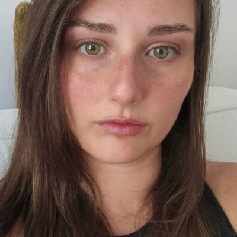

# Mentors

Mentor e mentee possono avere un legame molto importante e duraturo, anche dopo la conclusione del bootcamp.
Cliccando sull'immagine di ogni mentor sarà possibile accedere al relativo profilo LinkedIn.

## Chiara Corrado (SheTech)
  
<a href="https://www.linkedin.com/in/chiaracorrado/">Linkedin</a> | <a href="https://github.com/kiaruzza">Github</a>

## Veronica Domestico (SheTech)
  
<a href="https://www.linkedin.com/in/veronica-domestico/">Linkedin</a> | <a href="https://github.com/RonnnieNike">Github</a>

## Paolo Micheletti (Hastega)
  
<a href="https://www.linkedin.com/in/pablo1255/">Linkedin</a>
