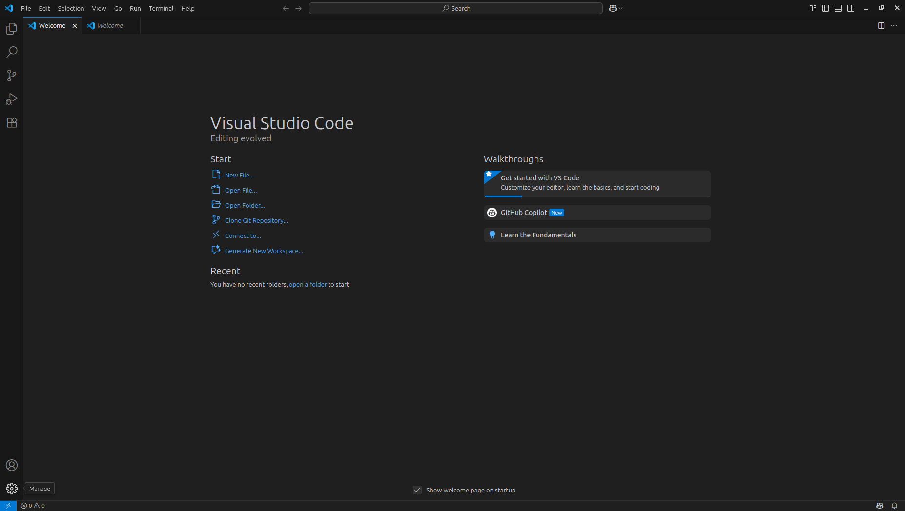

# Visual studio code

VSCode è un editor di codice sorgente sviluppato da Microsoft che supporta una vasta gamma di linguaggi di programmazione.

## Per Windows

**Step 1:** Vai al sito web ufficiale di Visual Studio Code all'indirizzo https://code.visualstudio.com/.


**Step 2:** Clicca sul pulsante "Download for Windows" per scaricare l'installer di Visual Studio Code per Windows.

**Step 3:** Apri l'installer appena scaricato e segui le istruzioni per completare l'installazione.

**Step 4:** Dopo aver completato l'installazione, apri Visual Studio Code dal menu Start o cercando "Visual Studio Code" nella barra di ricerca di Windows.

## Per Mac

**Step 1:** Vai al sito web ufficiale di Visual Studio Code all'indirizzo https://code.visualstudio.com/.


**Step 2:** Clicca sul pulsante "Download Mac Universal" per scaricare l'installer di Visual Studio Code per Mac.

**Step 3:** Apri il pacchetto appena scaricato e trascina l'icona di Visual Studio Code nella cartella "Applicazioni" per completare l'installazione.

**Step 4:** Dopo aver completato l'installazione, apri Visual Studio Code dalla cartella "Applicazioni" o dalla barra delle applicazioni di macOS.

**Ben fatto! 🎉**

Ora puoi iniziare ad utilizzare Visual Studio Code.


## Per Linux (Debian/Ubuntu-based)

**Step 1:** Apri il terminale e importa la chiave GPG di Microsoft.

```bash
wget -qO- https://packages.microsoft.com/keys/microsoft.asc | gpg --dearmor > packages.microsoft.gpg
sudo install -o root -g root -m 644 packages.microsoft.gpg /usr/share/keyrings/
```

**Step 2:** Aggiungi il repository di Visual Studio Code.

```bash
sudo sh -c 'echo "deb [arch=amd64 signed-by=/usr/share/keyrings/packages.microsoft.gpg] https://packages.microsoft.com/repos/vscode stable main" > /etc/apt/sources.list.d/vscode.list'
```

**Step 3:** Aggiorna la lista dei pacchetti.

```bash
sudo apt update
```

**Step 4:** Installa Visual Studio Code.

```bash
sudo apt install code
```

**Step 5:** Una volta completata l'installazione, puoi aprire Visual Studio Code dal menu delle applicazioni o digitando:

```bash
code
```

**Ben fatto! 🎉**

Ora puoi iniziare ad utilizzare Visual Studio Code anche su Linux.


